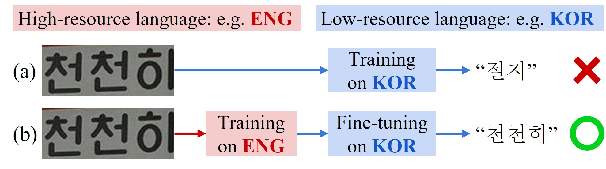
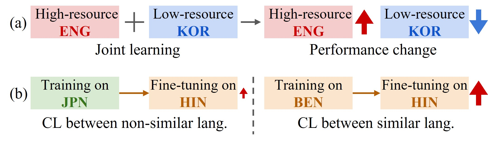

# Cross-Lingual Learning in Multilingual Scene Text Recognition
Official PyTorch implementation | [paper](https://arxiv.org/abs/2312.10806) | [training and evaluation data](#download-preprocessed-lmdb-datasets-for-training-and-evaluation) | [pretrained model](#pretrained_models) | <br>

**Preliminaries:** 
1. Multilingual STR: A task to recognize text from multiple languages in a word- or line-level scene image.
2. Cross-Lingual Learning (CLL): A methodology for transferring knowledge from one language to another.

**What we did:**
1. Verified two general insights about CLL and showed that **the two general insights may not be applied to multilingual STR.**
2. Showed that **CLL is simple and highly effective for improving performance in low-resource languages.**
3. Found the condition where CLL works well: **the crucial condition for CLL is the dataset size of high-resource languages, regardless of the kind of high-resource languages.**

**More detail:**
1. In this work, we investigate **CLL for multilingual scene text recognition (STR).** <br>
CLL transfers knowledge from one language to another.
Often, the number of resources in each language is not even.
There are high-resource languages such as English and low-resource languages such as Korean.
Generally, the performance on a low-resource language is low, and improving the performance requires more resources.
In this case, **instead of obtaining more resources, applying CLL from an existing high-resource language to the low-resource language can improve the performance**, as shown in the figure below.

<p align="center">
   <br>
   <em> (a) Monolingual training on a low-resource language Korean (KOR) results in incorrect predictions, whereas (b) CLL from a high-resource language English (ENG) to KOR leads to correct predictions.</em>
</p>


2. **We aim to find the condition where CLL works well.**
To do so, we first **verify two general insights about CLL discussed in previous works ([MRN](https://github.com/simplify23/MRN) and [M-BRET](https://arxiv.org/abs/1906.01502))**:
(a) joint learning with high- and low-resource languages may reduce performance on low-resource languages, and (b) CLL works best between similar languages.
By using a representative multilingual scene text dataset [MLT19](https://rrc.cvc.uab.es/?ch=15&com=introduction), we show that **the two general insights may not be applied to multilingual STR.**
<p align="center">
   <br>
   <em> Two general insights about CLL related to (a) joint learning and (b) cascade learning (CL). </em>
</p>


3. After that, through extensive experiments with additional data [SynthMLT](https://github.com/MichalBusta/E2E-MLT), we empirically show that **the crucial factor is the number of samples in high-resource languages rather than the similarity between languages.**
In other words, CLL works well when we have sufficiently large samples in high-resource languages regardless of the kind of high-resource languages.
We assume this is because **the essential knowledge of STR is distinguishing text in the image and can be learned from any language.**

We hope this work helps get more insights into multilingual STR.


<!-- ## News
- **Dec 16, 2023**: Initial upload -->

## Getting Started
### Installation
This work was tested with PyTorch 1.12.1, CUDA 11.3, Python 3.8, and Linux. <br>
Install conda >= 4.11.0  (python >= 3.8) and then run the following commands. <br>
```
conda create -n CLL python=3.8 -y
conda activate CLL

git clone https://github.com/ku21fan/CLL-STR.git
cd ./CLL-STR
pip install torch==1.12.1+cu113 torchvision==0.13.1+cu113 torchaudio==0.12.1 --extra-index-url https://download.pytorch.org/whl/cu113
pip install -r requirements.txt
```

<h3 id="pretrained_models"> Run demo with pretrained model <a href="https://colab.research.google.com/github/ku21fan/CLL-STR/blob/main/colab_demo.ipynb" target="_parent"></a> </h3>

1. [Download pretrained model](https://www.dropbox.com/scl/fo/uip1fanfsgu2yxerfofv6/h?rlkey=sd93rztv4gfwmmg7ukzrho0e1&dl=0) <br>
   For example, download [SVTR_joint_All.pth](https://www.dropbox.com/scl/fi/q9r2ebbnr94xv4azyl7o1/SVTR_joint_All.pth?rlkey=wsonhqkffwyb4jixva44p0s5y&dl=0) for demo.
   ```
   wget -O SVTR_joint_All.pth https://www.dropbox.com/scl/fi/q9r2ebbnr94xv4azyl7o1/SVTR_joint_All.pth?rlkey=wsonhqkffwyb4jixva44p0s5y
   ```
2. Add image files to test into `demo_image/`
3. Run demo.py
   ```
   CUDA_VISIBLE_DEVICES=0 python3 demo.py --model_name SVTR --image_folder demo_image/ \
   --saved_model SVTR_joint_All.pth
   ```

#### Prediction on demo images
Here, LAT is considered a high-resource language (28K) compared to other languages. The results below show the effectiveness of CLL.
   | demo images | [SVTR_joint_All_but_LAT](https://www.dropbox.com/scl/fi/vh7hadt745e0bkvx3ihzb/SVTR_joint_All_but_LAT.pth?rlkey=756sc51vvp23xl6yh5zx2edmu&dl=0) | [SVTR_joint_All](https://www.dropbox.com/scl/fi/q9r2ebbnr94xv4azyl7o1/SVTR_joint_All.pth?rlkey=wsonhqkffwyb4jixva44p0s5y&dl=0) | Ground Truth |
   | ---         |     ---      |     ---      |          --- |
   |     |   اﻟﺤﻢ       | اﻟﺒﺎب     |  الباب   |
   |     |   বান       | রাখিবেন   | রাখিবেন |
   |     |   か本       | 北京西    | 北京西 |
   |     |   ज        | मंडप      | मंडप |
   |     |   ٥り     | くすり      | くすり |
   |     |   상온     | 냉면은    | 냉면은 |
   |     |   디센다   | CUISINE   | CUISINE |


### Download preprocessed lmdb datasets for training and evaluation
We use [MLT19](https://rrc.cvc.uab.es/?ch=15&com=introduction) and [SynthMLT](https://github.com/MichalBusta/E2E-MLT) datasets.
MLT19 and SynthMLT consist of 7 scripts: Arabic (ARA), Bengali (BEN), Chinese (CHI), Hindi (HIN), Japanese (JPN), Korean (KOR), and Latin (LAT). 
LAT consists of English, French, German, and Italian.

Download the preprocessed lmdb datasets from [here](https://www.dropbox.com/scl/fi/js1y8dd6y0sethbuge1zl/CLL-data.zip?rlkey=bca3631p91mw1f98qhh79qprg&dl=0), or use wget as follows.
```
wget -O CLL-data.zip https://www.dropbox.com/scl/fi/js1y8dd6y0sethbuge1zl/CLL-data.zip?rlkey=bca3631p91mw1f98qhh79qprg
unzip CLL-data.zip -d data/
```
The structure of `data/` is as follows:
```
data
├── training
│   ├── ARA
│   ├── BEN
│   ├── CHI
│   ├── HIN
│   ├── JPN
│   ├── KOR
│   ├── LAT
│   ├── SynthMLT_ARA
│   ├── SynthMLT_BEN
│   ├── SynthMLT_CHI
│   ├── SynthMLT_HIN
│   ├── SynthMLT_JPN
│   ├── SynthMLT_KOR
│   └── SynthMLT_LAT
├── validation
│   ├── ARA
│   ├── BEN
│   ├── CHI
│   ├── HIN
│   ├── JPN
│   ├── KOR
│   └── LAT
└── evaluation
    ├── ARA
    ├── BEN
    ├── CHI
    ├── HIN
    ├── JPN
    ├── KOR
    └── LAT
```

### Training
1. Train SVTR with only one language data (LAT). For detail, check [--select_data part](https://github.com/ku21fan/CLL-STR/blob/e65ac0288ea41c0cba7191141b838e7ab0d1eb4f/train.py#L532-L573) in train.py.
   ```
   CUDA_VISIBLE_DEVICES=0 python3 train.py --model_name SVTR --exp_name SVTR_lang_L --select_data lang_L
   ```

2. Joint learning with all seven languages (Related to Table 2 in the paper)
   ```
   CUDA_VISIBLE_DEVICES=0 python3 train.py --model_name SVTR --exp_name SVTR_joint_All --select_data lang_CBHJAKL
   ```

3. Cascase learning: Pre-train SVTR on LAT then HIN (Related to Table 3 in the paper)
   ```
   CUDA_VISIBLE_DEVICES=0 python3 train.py --model_name SVTR --exp_name SVTR_L_to_H \
   --num_iter 10000 --saved_model saved_models/SVTR_lang_L/best_score.pth --select_data lang_H
   ```

4. Joint learning with all seven languages but using only 2K LAT instead of all LAT = _Base_ setting of Table 4 in the paper.
   ```
   CUDA_VISIBLE_DEVICES=0 python3 train.py --model_name SVTR --exp_name SVTR_joint_Base \
   --data_usage_LAT 2000 --select_data lang_CBHJAKL
   ```

   Joint learning with _Base_ setting + 2K SynthMLT KOR
   ```
   CUDA_VISIBLE_DEVICES=0 python3 train.py --model_name SVTR --exp_name SVTR_joint_Base_2KSynthMLT_K \
   --data_usage_LAT 2000 --data_usage_SynthMLT 2000 --select_data lang_CBHJAKL-SynthMLT_K
   ```

   Joint learning with _Base_ setting + all SynthMLT KOR
   ```
   CUDA_VISIBLE_DEVICES=0 python3 train.py --model_name SVTR --exp_name SVTR_joint_Base_allSynthMLT_K \
   --data_usage_LAT 2000 --select_data lang_CBHJAKL-SynthMLT_K
   ```


### Evaluation
Test SVTR model.
```
CUDA_VISIBLE_DEVICES=0 python3 test.py --model_name SVTR --saved_model saved_models/SVTR_joint_All/best_score.pth
```


### Main arguments
train.py
* `--train_data`: folder path for training lmdb dataset. default: `data/training/`
* `--valid_data`: folder path for validation lmdb dataset. default: `data/validation/`
* `--eval_data`: folder path for evaluation lmdb dataset. default: `data/evaluation/`
* `--model_name`: select model 'CRNN' or 'SVTR'.
* `--saved_model`: assign the saved model for fine-tuning

test.py
* `--eval_data`: folder path for evaluation lmdb dataset. default: `data/evaluation/`
* `--model_name`: select model 'CRNN' or 'SVTR'.
* `--saved_model`: assign the saved model for evaluation.

demo.py
* `--image_folder`: path for image_folder which contains text images. default: `demo_image/`
* `--model_name`: select model 'CRNN' or 'SVTR'.
* `--saved_model`: assign the saved model to use.


## Citation
Please consider citing this work in your publications if it helps your research.
```
@inproceedings{baek2023CLLSTR,
  title={Cross-Lingual Learning in Multilingual Scene Text Recognition},
  author={Baek, Jeonghun and Matsui, Yusuke and Aizawa, Kiyoharu},
  booktitle={IEEE International Conference on Acoustics, Speech and Signal Processing (ICASSP)},
  year={2024}
}
```

## Contact
Feel free to contact us if there is any question: Jeonghun Baek ku21fang@gmail.com

## Acknowledgements
This implementation has been based on the repositories [STR-Fewer-Labels](https://github.com/ku21fan/STR-Fewer-Labels) and [MRN](https://github.com/simplify23/MRN).

## License
MIT
